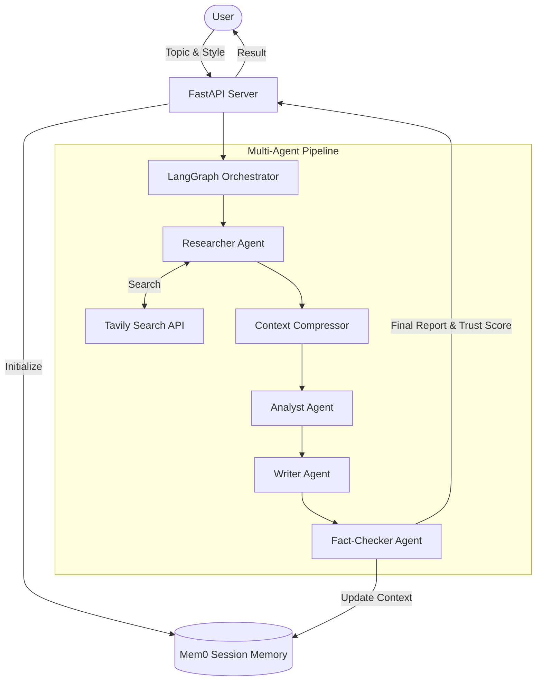

# Multi-Agent Research System

An automated pipeline that searches the web, synthesizes data, and fact-checks information to produce reliable research reports.

**Live Demo**: [https://multi-agent-research-system-bwnyl3w8j.vercel.app](https://multi-agent-research-system-bwnyl3w8j.vercel.app)

---

## How It Works

When a user submits a topic, the system orchestrates four specialized agents to complete the research:

1. **Researcher**: Queries the web for current, relevant data using the Tavily search API.
2. **Compressor**: Extracts only the most valuable context from the raw search results to maintain focus and speed.
3. **Analyst & Writer**: Synthesizes the compressed data into a coherent narrative, formatting it into a professional report.
4. **Fact-Checker**: Cross-references the final draft against the original raw data, calculating a confidence score and citing verifiable claims.

The system uses memory to retain context across user sessions, allowing for follow-up questions without restarting the research from scratch.

## System Architecture



## Performance & Reliability

This system is built for production-grade reliability, verified by rigorous testing and an optimized architecture:

* **Test Coverage**: **100% Pass Rate** (153/153 automated Pytest cases passing across agents, routing, and database logic).
* **Speed**: End-to-end multi-agent research pipeline completes in **~15-25 seconds** (powered by Groq's Llama-3-70b LPU inference).
* **Security**: 0 exposed secrets, SQLite connection-leak prevention, isolated non-root execution via Systemd, and strict CORS enforcement.
* **Resilience**: Nginx reverse proxy protects against abuse with strict rate limiting (10 req/s), coupled with automatic service recovery.

## Technology Stack

**Frontend**
* Next.js 14 (React)
* Tailwind CSS
* Hosted on Vercel

**Backend**
* FastAPI (Python)
* LangGraph & LangChain (Agent routing)
* LLaMA-3 70B via Groq (Inference)
* Mem0 (Session memory)
* SQLite (Job tracking)
* Hosted on AWS EC2 (Nginx + Systemd + Gunicorn)

---

## Local Development Setup

### 1. Backend

Requires Python 3.12+.

```bash
# Clone repository
git clone https://github.com/SarvagyaGupta-19/Multi-agent-research-system.git
cd Multi-agent-research-system

# Create virtual environment and install dependencies
python -m venv .venv
source .venv/bin/activate  # Windows: .venv\Scripts\activate
pip install -r requirements.txt

# Configure environment variables
cp .env.example .env
# Edit .env to add your GROQ_API_KEY, TAVILY_API_KEY, and MEM0_API_KEY

# Start the API server
uvicorn api.main:app --reload --port 8000
```

### 2. Frontend

Requires Node.js 18+.

```bash
# In a new terminal, navigate to the frontend directory
cd frontend

# Install dependencies and start the development server
npm install
npm run dev
```

The application will be available at `http://localhost:3000`.

---

## Testing

The backend includes a comprehensive test suite covering all agents, routing, and database interactions.

```bash
# Run all tests
pytest
```

## Deployment

To deploy this system to production, see the [Deployment Guide](deploy/README.md).

## License

MIT License
